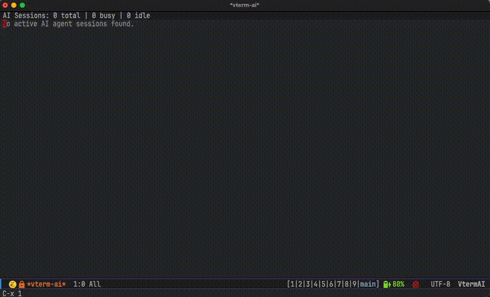

# vterm-ai



## Overview

vterm-ai is an Emacs package that provides a dashboard to monitor AI coding agent sessions running in vterm buffers.

It periodically collects session information and displays status, model, working directory, and the last human prompt for each agent — all in a single, lightweight buffer.

## Features

- List all active AI agent sessions with their current state
- Status display: `IDLE` (waiting for prompt), `BUSY` (working), `ASKING` (waiting for user response), `RUNNING` (process active, state unknown)
- Show session title, model name, working directory, and last human prompt
- Jump to the corresponding vterm buffer with `RET`
- Asynchronous data collection — does not block Emacs
- Extensible provider architecture for supporting multiple agent types

## Requirements

- Emacs 27.1+
- [vterm](https://github.com/akermu/emacs-libvterm)
- [Claude Code](https://docs.anthropic.com/en/docs/claude-code) CLI (for the Claude provider)
- [Codex](https://openai.com/index/introducing-codex/) CLI (for the Codex provider, experimental — see below)
- [Cursor](https://www.cursor.com/) CLI (for the Cursor provider, experimental — see below)

## Installation

Add the package directory to your `load-path` and require it:

```emacs-lisp
(add-to-list 'load-path "/path/to/emacs-vterm-ai")
(require 'vterm-ai)
```

## Usage

```
M-x vterm-ai
```

This opens the `*vterm-ai*` dashboard buffer, which auto-refreshes every 30 seconds.

### Keybindings

| Key   | Action                                    |
|-------|-------------------------------------------|
| `RET` | Jump to the vterm buffer                  |
| `o`   | Open vterm buffer in another window       |
| `d`   | Open dired in the session's directory     |
| `D`   | Show session detail (recent prompts, etc) |
| `g`   | Refresh dashboard                         |
| `n`   | Next session                              |
| `p`   | Previous session                          |
| `q`   | Quit dashboard                            |

### Configuration

```emacs-lisp
;; Providers to enable (default: '(claude))
(setq vterm-ai-enabled-providers '(claude cursor))

;; Dashboard refresh interval in seconds (default: 30)
(setq vterm-ai-refresh-interval 30)
```

## Architecture

```
vterm-ai.el            Entry point, M-x vterm-ai command
vterm-ai-data.el       Common layer: session struct, provider registry,
                       process tree walking, vterm buffer matching,
                       async collection with generation control
vterm-ai-claude.el     Claude Code provider: async session discovery
                       via `claude agents --json', JSONL transcript
                       parsing for title / model / last prompt
vterm-ai-codex.el      Codex provider: process detection via ps/lsof,
                       session info from ~/.codex/state_5.sqlite
vterm-ai-cursor.el     Cursor provider: process detection via ps/lsof,
                       status extraction from vterm buffer names
vterm-ai-dashboard.el  Dashboard UI rendering and keybindings
```

### Provider interface

Each provider registers a plist with the following keys:

| Key                    | Signature              | Description                         |
|------------------------|------------------------|-------------------------------------|
| `:name`                | string                 | Provider identifier (e.g. "claude") |
| `:get-sessions-async`  | `(callback) -> process`| Discover sessions asynchronously    |
| `:enrich`              | `(session) -> nil`     | Populate title, model, last-prompt  |
| `:detail`              | `(session) -> string`  | Generate detail view text           |

To add support for a new agent (e.g. Cursor), create a new file that implements these four functions and calls `vterm-ai-register-provider`.

## Notes

### Codex provider (experimental)

To enable, add `codex` to `vterm-ai-enabled-providers`.

This provider detects Codex processes and retrieves model info from `~/.codex/state_5.sqlite`. Status and project name are extracted from the vterm buffer name.

#### Codex side configuration

Add the following to `~/.codex/config.toml` under the `[tui]` section:

```toml
[tui]
terminal_title = ["app-name", "activity", "run-state", "project-name"]
```

This causes Codex to set the terminal title with status and project name, which vterm reflects in the buffer name. The provider maps these to dashboard statuses:

| Terminal title keyword | Dashboard status |
|------------------------|------------------|
| Ready                  | `IDLE`           |
| Working                | `BUSY`           |
| Action Required        | `ASKING`         |

Without this configuration, Codex sessions will appear as `RUNNING` with no title.

### Cursor provider (experimental)

To enable, add `cursor` to `vterm-ai-enabled-providers`.

This provider detects `cursor-agent` processes and extracts status and title from vterm buffer names.

#### Cursor side configuration

Add the following to `~/.cursor/cli-config.json`:

```json
{
  "display": {
    "showStatusIndicators": true
  }
}
```

This causes Cursor to set the terminal title with status keywords, which vterm reflects in the buffer name. The provider maps these to dashboard statuses:

| Terminal title keyword | Dashboard status |
|------------------------|------------------|
| Ready                  | `IDLE`           |
| Working                | `BUSY`           |
| Waiting for you        | `ASKING`         |

Without this configuration, Cursor sessions will appear as `RUNNING` with no title.

## License

GPL-3.0-or-later
